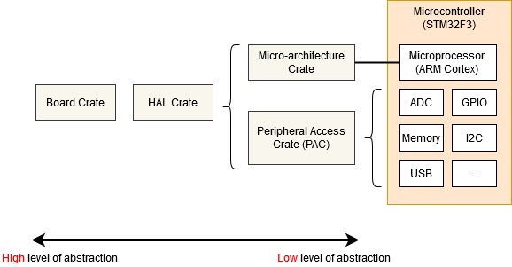

# Rust Embedded Development: Crate Hierarchy

## Overview

Embedded Rust development follows a layered architecture with four main crate types. Each layer builds upon the one below it, providing progressively higher levels of abstraction while maintaining type safety and performance.



```
┌─────────────────────────────────────┐
│    Board Crate (Highest Level)      │
│  (e.g., stm32f3-discovery)         │
└──────────────────┬──────────────────┘
                   │ depends on
┌──────────────────▼──────────────────┐
│    HAL Crate (Hardware Abstraction) │
│  (e.g., stm32f3xx-hal)             │
└──────────────────┬──────────────────┘
                   │ depends on
┌──────────────────▼──────────────────┐
│  Microarchitecture Crate            │
│  (e.g., cortex-m, cortex-m-rt)     │
└──────────────────┬──────────────────┘
                   │ depends on
┌──────────────────▼──────────────────┐
│    PAC (Peripheral Access Crate)    │
│  (e.g., stm32f3xx)                 │
└─────────────────────────────────────┘
```

---

## 1. PAC (Peripheral Access Crate)

### What is a PAC?

The **Peripheral Access Crate** is the lowest-level abstraction layer. It provides raw, type-safe access to hardware registers without any high-level abstraction.

### Key Characteristics

- **Auto-generated**: Created from SVD (System View Description) XML files using `svd2rust` tool
- **Chip-specific**: Each microcontroller family has its own PAC (e.g., `stm32f3xx`, `nrf52840-pac`)
- **Direct register access**: Reading/writing struct fields directly maps to register operations
- **Type-safe only**: Provides type safety for register access, but minimal ergonomics
- **No data hiding**: Exposes all register bits, even obscure or dangerous ones

### Structure

```rust
// PAC provides generated structs for each peripheral
pub struct SPI1 {
    pub cr1: CR1,      // Control Register 1
    pub cr2: CR2,      // Control Register 2
    pub sr: SR,        // Status Register
    pub dr: DR,        // Data Register
    // ... more registers
}

// Each register is also a struct with individual bit fields
pub struct CR1 {
    pub cpha: bool,    // Clock Phase
    pub cpol: bool,    // Clock Polarity
    pub mstr: bool,    // Master mode
    // ... more fields
}
```

### Usage in Your Project

```rust
use stm32f3_discovery::stm32f3xx_hal::pac;

let mut dp = pac::Peripherals::take().unwrap();  // Take PAC peripherals

// Direct register manipulation
dp.RCC.apb1enr.modify(|_, w| w.tim2en().set_bit());  // Enable TIM2 clock
dp.SPI1  // Access SPI1 peripheral via PAC
```

### When to Use PAC

- Debugging: Reading exact register values
- Features not covered by HAL
- Understanding what the HAL is doing under the hood
- Performance-critical code requiring specific register manipulation

---

## 2. Microarchitecture Crate

### What is a Microarchitecture Crate?

Microarchitecture crates provide abstractions for **CPU-level functionality** that is common across all implementations of a processor family (e.g., all ARM Cortex-M processors).

### Key Characteristics

- **Processor-family specific**: Not chip-specific, works for all Cortex-M processors
- **Independent of chip peripherals**: Doesn't know about SPI, UART, timers, etc.
- **Core processor features**: Interrupt handling, system timers, debugging interfaces
- **Essential runtime**: Manages startup, interrupt vectors, exception handling

### Common Microarchitecture Crates

| Crate | Purpose |
|-------|---------|
| `cortex-m` | Core processor peripherals (NVIC, DWT, ITM, SysTick) |
| `cortex-m-rt` | Runtime and entry point (`#[entry]` macro) |
| `cortex-m-macros` | Procedural macros for RTIC and other features |
| `riscv` | RISC-V processor cores |
| `msp430` | MSP430 processors |

### Structure

```rust
// cortex-m provides core processor peripherals
pub struct Peripherals {
    pub DWT: DWT,    // Data Watchpoint and Trace
    pub DCB: DCB,    // Debug Control Block
    pub NVIC: NVIC,  // Nested Vectored Interrupt Controller
    pub ITM: ITM,    // Instrumentation Trace Macrocell
    pub SCB: SCB,    // System Control Block
    pub SYST: SYST,  // SysTick Timer
    pub FPB: FPB,    // Flash Patch and Breakpoint
}
```

### Usage in Your Project

```rust
use cortex_m::{self, asm, iprint, iprintln};
use cortex_m::peripheral::{Peripherals, DWT, ITM, NVIC, SYST};
use cortex_m_rt::entry;

// Access core Cortex-M peripherals
let cp = Peripherals::take().unwrap();
let dwt = cp.DWT;      // Data Watchpoint Trace for profiling
let itm = cp.ITM;      // Instrumentation Trace Macrocell for debugging output

// Use runtime macros
#[entry]  // ← Cortex-M-rt macro for main entry point
fn main() -> ! {
    loop {}
}

// Assembly-level operations
cortex_m::asm::wfi();  // Wait for Interrupt
```

### Core Concepts

#### NVIC (Nested Vectored Interrupt Controller)
- Manages interrupt priorities and enabling/disabling
- ARM Cortex-M standard across all chips

#### DWT (Data Watchpoint and Trace)
- Performance monitoring and debugging
- Cycle counting, event tracing

#### ITM (Instrumentation Trace Macrocell)
- Low-overhead debug output channel
- Used in your project for `iprintln!` debug messages

#### SysTick
- System tick timer for OS scheduling
- Available on all Cortex-M processors

### When to Use Microarchitecture Crates

- Interrupt setup and configuration
- System-level operations (power modes, resets)
- Debug output and profiling
- Processor feature detection

---

## 3. HAL Crate (Hardware Abstraction Layer)

### What is a HAL?

The **Hardware Abstraction Layer** provides ergonomic, high-level APIs for chip-specific peripherals. It abstracts away register manipulation while implementing standard Rust embedded traits.

### Key Characteristics

- **Chip-specific**: Each chip family has its own HAL (e.g., `stm32f3xx-hal`, `nrf52-hal`)
- **Trait-based**: Implements `embedded-hal` traits for standardization
- **High-level APIs**: Provides convenient configuration options
- **Built on PAC**: Uses PAC types internally for register access
- **Portability**: Code using HAL abstractions can work with different chips

### Common HALs

| HAL | Chip Family | Example |
|-----|------------|---------|
| `stm32f3xx-hal` | STM32F3 series | Your project |
| `stm32h7xx-hal` | STM32H7 series | Faster STM32 |
| `nrf52-hal` | Nordic nRF52 | Wireless focused |
| `rp2040-hal` | Raspberry Pi Pico | RP2040 chip |
| `atsamd-hal` | Atmel SAMD | Arduino boards |

### Structure

```rust
// HAL provides high-level types
pub struct Spi<SPI, PINS> {
    spi: SPI,           // Inner PAC type
    pins: PINS,
    // ... other fields
}

impl<SPI, PINS> Spi<SPI, PINS> {
    pub fn spi1(
        spi: SPI,
        pins: PINS,
        mode: Mode,
        freq: Hertz,
        clocks: Clocks,
        apb: &mut APB2,
    ) -> Self { /* ... */ }
}

// Implements standard embedded-hal traits
impl Transfer<u8> for Spi<SPI1, PINS> {
    type Error = Error;
    fn transfer(&mut self, words: &mut [u8]) -> Result<(), Error> { /* ... */ }
}
```

### Usage in Your Project

```rust
use stm32f3_discovery::stm32f3xx_hal::{
    delay::Delay,
    spi::{Spi, Mode, Polarity, Phase, SckPin, MosiPin, MisoPin},
    time::rate::Hertz,
};

// HAL provides high-level configuration
let mode = Mode {
    polarity: Polarity::IdleHigh,
    phase: Phase::CaptureOnSecondTransition,
};

let spi = Spi::spi1(
    dp.SPI1,                    // PAC type inside
    (sck, miso, mosi),
    mode,
    Hertz(1_000_000),           // Ergonomic frequency
    clocks,
    &mut rcc.apb2,
);

// Use standard embedded-hal trait
spi.transfer(&mut buffer)?;

// HAL also provides high-level delay
let delay = Delay::new(cp.SYST, clocks);
delay.delay_ms(1000);           // Simple millisecond delay
```

### Standard embedded-hal Traits

The `embedded-hal` crate defines common traits that HALs implement:

```rust
// SPI trait
pub trait Transfer<Word> {
    type Error;
    fn transfer(&mut self, words: &mut [Word]) -> Result<(), Self::Error>;
}

// GPIO traits
pub trait OutputPin {
    type Error;
    fn set_high(&mut self) -> Result<(), Self::Error>;
    fn set_low(&mut self) -> Result<(), Self::Error>;
}

// Serial traits
pub trait Serial<Word> {
    type Error;
    fn try_read(&mut self) -> Result<Word, nb::Error<Self::Error>>;
    fn try_write(&mut self, byte: Word) -> Result<(), nb::Error<Self::Error>>;
}

// Timer traits
pub trait CountDown {
    type Time;
    fn start<T>(&mut self, count: T) where T: Into<Self::Time>;
    fn wait(&mut self) -> Result<(), nb::Error<Void>>;
}
```

### Advantages of HAL Layer

1. **Portability**: Code using HAL traits works across different chips
2. **Safety**: Register manipulation is hidden behind safe abstractions
3. **Ergonomics**: High-level APIs reduce boilerplate
4. **Reusability**: Drivers written for `embedded-hal` traits work on any HAL
5. **Debugging**: Abstractions make code more readable and maintainable

### When to Use HAL

- Most application code
- Standard peripheral operations (SPI, UART, GPIO)
- Building reusable drivers and libraries
- Portable code across different chips

---

## 4. Board Crate (Board Support Package)

### What is a Board Crate?

A **Board Crate** is the highest-level abstraction layer. It provides board-specific convenience functions that hide the complexity of peripheral initialization for a specific development board.

### Key Characteristics

- **Board-specific**: Hardcodes pin mappings for a particular board
- **Pre-configured**: Provides ready-to-use functions for common peripherals
- **Reduces boilerplate**: No need to manually configure pins each time
- **Built on HAL**: Uses HAL abstractions internally
- **Opinionated**: Makes design decisions for the board

### Common Board Crates

| Board Crate | Board | Target |
|------------|-------|--------|
| `stm32f3-discovery` | STM32F3 Discovery | Your project |
| `pico` | Raspberry Pi Pico | RP2040 |
| `nrf52840-dk` | Nordic DK | nRF52840 |
| `rp-pico` | Raspberry Pi Pico | RP2040 alternative |

### Structure

A typical board crate provides:

```rust
// Board crate exposes board-specific functions
pub fn led_init() -> LED { /* ... */ }
pub fn button_init() -> Button { /* ... */ }
pub fn serial_init() -> Serial { /* ... */ }

// Pre-configured types for board components
pub struct LED { /* ... */ }
pub struct Button { /* ... */ }
pub struct Gyroscope { /* ... */ }

impl LED {
    pub fn on(&mut self) { /* ... */ }
    pub fn off(&mut self) { /* ... */ }
    pub fn toggle(&mut self) { /* ... */ }
}
```

### Usage Pattern

```rust
// Typical board crate usage
use stm32f3_discovery::*;

fn main() {
    let mut led = led::init();      // Board-specific LED init
    let mut button = button::init(); // Board-specific button init
    
    loop {
        if button.is_pressed() {
            led.on();
        } else {
            led.off();
        }
    }
}
```

### In Your Project

```rust
pub use stm32f3_discovery::stm32f3xx_hal::{
    delay::Delay,
    spi::{Spi, Mode, ...},
    // ... HAL types
};

// The board crate re-exports HAL for your convenience
// It knows the pin configuration for STM32F3 Discovery board
```

### Pin Mapping Example

In your project, the board crate abstracts away the specific pin locations:

```rust
// Without board crate, you'd need to know:
// - PE3 is CS pin for gyroscope
// - PA5, PA6, PA7 are SPI pins
// - Specific clock domains (APB2 for SPI1)

// With board crate, functions could look like:
// pub fn gyro_spi_init() -> Spi { /* configures known pins */ }
// pub fn gyro_cs_pin() -> OutputPin { /* returns PE3 */ }
```

### When to Use Board Crates

- Quick prototyping on development boards
- Learning embedded Rust
- Reducing boilerplate for known boards
- When portability to other boards is not needed

---

## Integration: How Everything Works Together

### Layer Interaction Diagram

```
┌──────────────────────────────────────────────────────┐
│          Your Application Code                       │
│  (Gyroscope driver, interrupt handlers, main loop)   │
└──────────────┬───────────────────────────────────────┘
               │ uses
┌──────────────▼───────────────────────────────────────┐
│      HAL Abstractions                                │
│  (Spi, Delay, Gpio, Timer abstractions)             │
│  ✓ Implements embedded-hal traits                    │
│  ✓ High-level, ergonomic APIs                        │
└──────────────┬───────────────────────────────────────┘
               │ wraps
┌──────────────▼───────────────────────────────────────┐
│      PAC + Microarchitecture                         │
│  (Direct register types, cortex-m peripherals)      │
│  ✓ Type-safe register access                        │
│  ✓ Core processor features                          │
└──────────────┬───────────────────────────────────────┘
               │ maps to
┌──────────────▼───────────────────────────────────────┐
│      Physical Hardware                               │
│  (STM32F3xx microcontroller + board)                 │
└──────────────────────────────────────────────────────┘
```

### Complete Example from Your Project

```rust
// Step 1: Import from all layers
use cortex_m::Peripherals as CorePeripherals;
use stm32f3_discovery::stm32f3xx_hal::{
    pac,                    // ← PAC layer
    prelude::*,             // ← HAL conveniences
    spi::Spi,              // ← HAL abstraction
};
use embedded_hal::blocking::spi::Transfer;  // ← Standard trait

pub fn init() -> (ITM, Delay, Spi<SPI1, ...>, impl OutputPin, DWT) {
    // Step 2: Take core Cortex-M peripherals (Microarch layer)
    let cp = CorePeripherals::take().unwrap();
    
    // Step 3: Take PAC peripherals (PAC layer)
    let mut dp = pac::Peripherals::take().unwrap();
    
    // Step 4: Enable TIM2 using PAC
    dp.RCC.apb1enr.modify(|_, w| w.tim2en().set_bit());
    
    // Step 5: Use HAL for high-level configuration
    let mut flash = dp.FLASH.constrain();
    let mut rcc = dp.RCC.constrain();
    let clocks = rcc.cfgr.freeze(&mut flash.acr);
    
    // Step 6: Create HAL peripherals with PAC types inside
    let spi = Spi::spi1(dp.SPI1, ...);  // Wraps PAC type
    let delay = Delay::new(cp.SYST, clocks);  // Uses Cortex-M SYST
    
    (cp.ITM, delay, spi, cs, cp.DWT)
}

// Step 7: Use standard embedded-hal traits
pub fn identify_gryoscope<PINS, CS>(
    spi: &mut Spi<SPI1, PINS>,
    cs: &mut CS,
) -> Result<&'static str, &'static str>
where
    CS: OutputPin,  // ← Standard embedded-hal trait
{
    // Use portable SPI interface
    spi.transfer(&mut buffer)?;  // ← Works with any HAL implementing trait
}
```

---

## Comparison Table

| Aspect | PAC | Microarch | HAL | Board |
|--------|-----|-----------|-----|-------|
| **Abstraction Level** | None | CPU | Peripheral | Board |
| **Scope** | Registers | Core processor | Chip peripherals | Dev board |
| **Chip-specific** | Yes | No | Yes | Yes |
| **Portability** | None | High | Medium | Low |
| **Ease of use** | Hard | Medium | Easy | Easiest |
| **Performance overhead** | None | Minimal | Minimal | Minimal |
| **Auto-generated** | Yes (from SVD) | No | No | No |
| **Trait-based** | No | Partial | Yes | Yes |
| **Use case** | Debugging, low-level | System, interrupts | Apps, drivers | Prototyping |

---

## Best Practices

### 1. **Use the Highest Appropriate Level**
   - Start with Board crate convenience functions
   - Drop to HAL when you need customization
   - Use PAC only when necessary

### 2. **Leverage embedded-hal Traits**
   - Write drivers against traits, not concrete types
   - Improves code reusability and portability

### 3. **Understand the Layering**
   - Know what each layer provides
   - Use debuggers to see PAC values if things go wrong
   - Read HAL source to understand register manipulation

### 4. **Build Reusable Drivers**
   - Create drivers that depend on `embedded-hal` traits
   - Works across multiple HALs and boards
   - Example: `cortex-m-semihosting`, `bmp180` I2C driver

### 5. **Mix Abstraction Levels Carefully**
   - Don't unnecessarily drop to PAC in application code
   - Keep PAC usage isolated if needed
   - Document why you're bypassing abstractions

---

## Summary

The four crate layers form a complete embedded Rust ecosystem:

- **PAC**: Type-safe register access (foundation)
- **Microarchitecture**: CPU-level features (system)
- **HAL**: Chip peripheral abstractions (drivers)
- **Board**: Board-specific convenience (applications)

Your project uses all four layers effectively—this demonstrates a well-structured, production-ready embedded Rust application!

